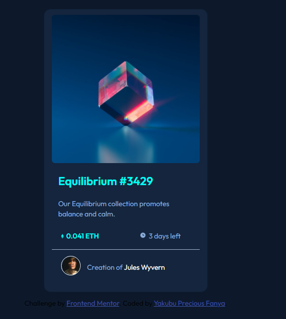

# Frontend Mentor - NFT preview card component solution

This is a solution to the [NFT preview card component challenge on Frontend Mentor](https://www.frontendmentor.io/challenges/nft-preview-card-component-SbdUL_w0U). Frontend Mentor challenges help you improve your coding skills by building realistic projects.

## Table of contents

- [Overview](#overview)
  - [The challenge](#the-challenge)
  - [Screenshot](#screenshot)
  - [Links](#links)
  - [Built with](#built-with)
- [Author](#author)

**Note: Delete this note and update the table of contents based on what sections you keep.**

## Overview

### The challenge

Users should be able to:

- View the optimal layout depending on their device's screen size
- See hover states for interactive elements

### Screenshot)

### Links

- Solution URL: [Add solution URL here](https://www.frontendmentor.io/challenges/nft-preview-card-component-SbdUL_w0U)
- Live Site URL: [Add live site URL here](https://preciousyaks17.github.io/NFT-Preview-Card-Component/)

## My process

### Built with

- Semantic HTML5 markup
- CSS custom properties
- Flexbox
- [Styled Components](https://styled-components.com/) - For styles

### What I learned

- Learnt positioning in CSS intensively

## Author

- Frontend Mentor - [@yourusername](https://www.frontendmentor.io/profile/yakubupreciousfanya)
- Twitter - [@yourusername](https://www.twitter.com/selah_presh)
